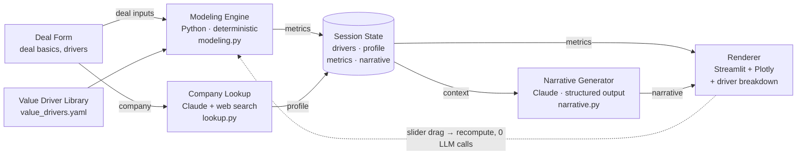

# CaseCraft — MVP Architecture

> **Historical design note (v0.2), kept for design history.** Written before the
> frontend rewrite, so parts of it are now out of date — the "Divergences" list
> at the bottom tracks the biggest ones (Streamlit was replaced by FastAPI +
> React; `formula` is a display string, not an evaluated expression). For the
> current state, quick start, and a diagram, see the [root README](README.md).
> The project was renamed from its "Case Engine" working name to **CaseCraft**.

*GTM Engineering portfolio project — architecture note, v0.2*

An end-to-end pipeline that turns a rep's deal inputs — and the value drivers they select for it — into a tailored, numbers-first business case: deterministic financial modeling paired with Claude for research and narrative, served as a live, adjustable Streamlit page.

## Scope pins for this pass

These are the deliberate scoping decisions locked in before building, so later work doesn't quietly drift:

- **Value drivers, not raw inputs.** Rep picks from a library instead of describing the problem freeform; each driver carries its own formula.
- **Manual selection, manual trigger.** A form, filled out and submitted by hand — no automated driver detection yet.
- **Live lookup, not an API.** Company context comes from Claude's web search, not a paid enrichment service.
- **Every driver is a dollar value.** All drivers resolve to $, so aggregation stays a simple sum — no mixed units to reconcile.

## System diagram

Two paths run through the same pipeline: an expensive one that runs once, on submit, and a cheap one that runs on every slider drag.



**Read it as:** on submit, two Claude calls run once and their results are cached in session state. Every slider drag after that recomputes locally in the Modeling Engine and never touches the LLM — that loop is the whole reason the demo feels instant.

## Value driver shape

The library's content is still being built together — this is the schema every driver has to fit, sketched against the one example carried over from earlier discussion.

```yaml
# illustrative only — the real library is TBD
- id: reduced_manual_data_entry
  name: "Reduced manual data entry"
  category: "Productivity"
  description: "Time reclaimed when a team stops manually re-keying data between systems."
  inputs:
    - {key: headcount, label: "People affected", type: number}
    - {key: hours_per_day, label: "Hours/day on this task", type: number}
    - {key: hourly_cost, label: "Loaded hourly cost", type: currency, default: 35}
    - {key: adoption_rate, label: "Year 1 adoption", type: percent, default: 70}
  formula: "headcount * hours_per_day * hourly_cost * 250 * reduction_pct * adoption_rate"
  narrative_hint: "Frame as reclaimed time, not headcount reduction."
```

Every driver has to resolve to a dollar value — annual, plus an optional one-time component — so the Modeling Engine's aggregation stays a straight sum across whichever drivers the rep selects, with no per-driver special-casing.

## Components

Seven pieces, each doing one job. The tag says whether it's math you can unit-test or a Claude call you can't.

| Component | Tag | What it does | File |
|---|---|---|---|
| Deal Form | Interface | Streamlit inputs: deal basics (company name/domain, deal size, term), then a multi-select checklist of value drivers, then the specific inputs those chosen drivers need. | `app.py` |
| Modeling Engine | Computed | Runs each selected driver's formula against the inputs the rep gave it, then sums the results into total annual value, payback period, and 3-year TCO. No LLM involved — this has to be defensible on its own. | `modeling.py` |
| Value Driver Library | Computed | Catalog of value drivers the rep can pick from; each one carries its own required inputs, formula, and default benchmarks. | `value_drivers.yaml` |
| Company Lookup | Generated | Claude with the web search tool, prompted to return a structured company profile: industry, size, recent context. | `lookup.py` |
| Session State | State | Holds the selected drivers and their inputs, the company profile, the computed metrics (aggregate and per-driver), and the narrative — so a slider drag never re-triggers a Claude call. | `st.session_state` |
| Narrative Generator | Generated | Claude call that takes the already-computed metrics — driver by driver — and the company profile as fixed facts, and writes the five skeleton sections as structured output. | `narrative.py` |
| Renderer | Interface | Assembles Plotly charts — aggregate ROI/payback plus a per-driver breakdown — and prose from the narrative into the fixed skeleton order; redraws on every recompute. | `app.py` |

## Request lifecycle

What actually happens between a rep hitting submit and a business case appearing on screen.

1. **Submit.** Rep fills in deal basics, checks off the value drivers that apply, fills in the inputs those drivers need, and submits.
2. **Compute, instantly.** *(deterministic)* Modeling Engine runs each selected driver's formula and sums the results into aggregate metrics. No network call.
3. **Look up the company.** *(generative)* Company Lookup asks Claude, with web search, for a structured profile of the prospect.
4. **Write the narrative.** *(generative)* Narrative Generator receives the per-driver and aggregate metrics plus the company profile as given facts, and drafts the five core sections.
5. **Render.** Renderer lays out the aggregate and per-driver charts alongside the narrative, in skeleton order.
6. **Adjust, live.** *(deterministic)* Rep tweaks an input on one driver — say, adoption rate. Modeling Engine recomputes that driver and the aggregate locally; charts update instantly. The narrative text stays put until the rep explicitly asks to regenerate it.

## Tech stack

| Layer | Choice | Why |
|---|---|---|
| UI | Streamlit | Fastest path to an interactive, internal-tool-style demo — no separate frontend to build. |
| Modeling | Python + Pydantic, driver-calculator registry | Deterministic, typed, and unit-testable — each driver is one small testable function, not one growing formula. |
| Charts | Plotly | Native Streamlit support; redraws instantly on local recompute, aggregate and per-driver alike. |
| LLM | Claude API, web search + structured output | Keeps the narrative grounded in numbers already computed, never inventing its own. |
| Config | YAML value driver library | Drivers are editable and reviewable in a diff without touching the modeling code. |
| Tests | pytest | Covers each driver's math and the aggregation logic, independent of anything Claude does. |
| Deploy | Streamlit Community Cloud + GitHub | Free, public demo link — the thing a hiring manager actually clicks. |

## MVP boundaries

What ships now, and what's deliberately held for later so the first pass stays buildable.

**In scope**
- Fixed core skeleton (5 sections)
- Value driver library — schema defined, drivers added collaboratively
- Manual multi-select driver picker
- Manual form trigger
- Live Claude company lookup
- Aggregated financial modeling across selected drivers
- Live slider recompute, no re-generation
- A few pre-loaded demo scenarios

**Deferred**
- Deal-tier / industry variant structure
- Automated (non-manual) driver selection
- Slack or CRM webhook triggers
- PDF / PPTX export
- Persistent case history / database
- Multi-user auth

## What comes after the MVP

Phase 2 adds deal-tier awareness — SMB stays a one-pager, enterprise gains a compliance and phased-rollout section — and grows the value driver library with more categories and industry-specific defaults. Phase 3 replaces the manual form trigger with a real trigger — a Slack slash-command or a simulated CRM stage-change webhook — so the case generates itself at the moment a deal actually needs one.

---
*Full visual version of this doc: see the published architecture artifact.*
