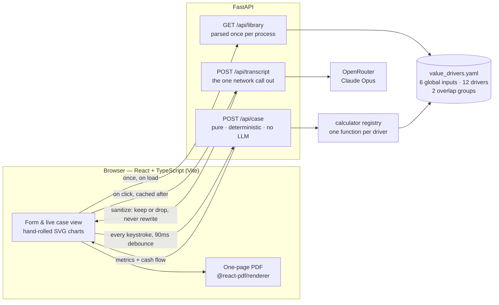

# CaseCraft

**Turn a deal and a set of value drivers into a defensible, numbers-first business case — live, in the browser.**

A rep enters the commercial shape of a deal, picks the value drivers that apply, and
supplies the inputs those drivers need. CaseCraft returns ROI, payback, TCO, a
contribution breakdown, a cash-flow curve, and a one-page PDF — every figure tracing
back to an input a rep can actually ask a customer for.

> **Status:** portfolio project, built module by module. Live demo:
> _`https://<your-project>.vercel.app`_ (fill in after the first deploy — see
> [docs/DEPLOYMENT.md](docs/DEPLOYMENT.md)).
>
> Source-available for review. No license is granted for reuse.

---

## The problem

In enterprise sales, the business case is often the thing a deal stalls on: the
champion needs numbers to take to a CFO, and "trust us, it pays for itself" doesn't
survive that room. Building a real one usually means a spreadsheet, a few days, and a
value consultant. CaseCraft compresses that to minutes and keeps the math defensible —
deterministic Python does the financials; the LLM only ever writes prose *around*
numbers it was handed, never invents them.

## What it does

1. **Deal basics** — company, the Platform's annual cost, one-time implementation, term.
2. **From the call (optional)** — paste notes or upload a transcript (`.txt`, `.vtt`,
   `.srt`). One Claude call suggests value drivers, each with the verbatim line from the
   call that supports it, and flags any shared numbers the customer stated.
3. **Pick the value drivers** — twelve, split across Cost Savings, Productivity Gains,
   and Risk Reduction. Overlap between drivers is flagged as guidance, never blocked.
4. **About the customer** — fill in the shared inputs the selected drivers actually use.
   Every default is an editable illustrative assumption.
5. **The case** — KPI tiles, a contribution chart, a cumulative cash-flow curve, and a
   driver-by-driver table. Tune any input and everything recomputes in milliseconds with
   **zero LLM calls**. Export a one-page PDF.

## Architecture

Two paths through one system, kept strictly apart:

- **Expensive path — runs once, on an explicit click.** Transcript analysis (one Claude
  call via OpenRouter). Cached client-side; never re-run by an input change. Company
  lookup and narrative generation will join this path (not built yet).
- **Cheap path — runs on every input change.** `POST /api/case` recomputes the whole
  financial model with **no LLM, no network, no I/O** beyond a cached YAML parse.
  Debounced 90 ms, aborting any in-flight request. Charts redraw; narrative text stays put.

Two rules hold everything together: **`/api/case` stays pure**, and **Claude never
invents a number** — the narrative generator will receive computed metrics as fixed facts.



More detail: [ARCHITECTURE.md](ARCHITECTURE.md) (original design note, pre-rewrite) and
[docs/value-driver-library.md](docs/value-driver-library.md) (driver schema + HTTP contract).

## Tech stack

| Layer | Choice |
|---|---|
| Frontend | React 19 + TypeScript + Vite. Charts are **hand-rolled SVG** — no chart library. |
| PDF | `@react-pdf/renderer`, generated on an explicit click only. |
| Backend | FastAPI + Pydantic. `snake_case` internally, `camelCase` on the wire via alias generators. |
| Modeling | Deterministic calculator registry — one small, unit-tested function per driver. |
| Library | A single `value_drivers.yaml` drives every label, unit, default, and note in the UI. |
| LLM | Claude (Opus) via **OpenRouter**, using the OpenAI SDK. Transcript analysis only. |
| Tests | `pytest` (backend, no key, no network) + `vitest` (frontend). No linter is configured. |

## Repo layout

```
backend/            deterministic core + FastAPI
  value_drivers.yaml    the library — the single source of truth
  models.py             Pydantic schemas (library + computed case)
  calculators.py        one @calculator("<id>") function per driver
  modeling.py           resolve inputs → run calculators → aggregate; payback + cash flow
  api.py                /api/library, /api/case, /api/transcript, + static frontend in prod
  transcript.py         pure: prompt assembly from the library + the sanitizer
  transcript_client.py  the only network call in the repo (one function)
frontend/           React + TypeScript (Vite)
  src/lib/              api client, chart math, conflict rules (mirrors the backend)
  src/pdf/              one-page PDF export
api/index.py        Vercel serverless entrypoint — re-exports the FastAPI app
tests/              backend: driver math, aggregation, HTTP contract, transcript sanitizing
sample-transcripts/ example discovery calls in several formats
docs/               deployment guide + value-driver-library reference
```

Frontend tests live beside their source (`frontend/src/**/*.test.ts`), not in `tests/`.

## Quick start

Prerequisites: Python 3.11+, Node 20+.

```bash
# 1. Python — create a venv and install runtime + dev deps
python -m venv .venv
.venv/Scripts/python.exe -m pip install -r requirements-dev.txt   # Windows
# source .venv/bin/activate && pip install -r requirements-dev.txt  # macOS/Linux

# 2. Frontend deps
npm --prefix frontend install

# 3. Run — two processes
.venv/Scripts/python.exe -m uvicorn api:app --reload --app-dir backend   # API on :8000
npm --prefix frontend run dev                                            # UI on :5173
```

Open **http://localhost:5173**. The UI proxies `/api` to the backend, so the same
relative paths work in development and production.

## Environment

Only `POST /api/transcript` needs a key. Everything else — and the entire test suite —
runs without one.

```bash
cp .env.example .env        # then paste your key
# OPENROUTER_API_KEY=sk-or-...
```

Get a key at <https://openrouter.ai/keys>. Without it, the transcript endpoint returns a
`503` naming the variable; the rest of the app is unaffected.

## Tests

```bash
.venv/Scripts/python.exe -m pytest        # backend — no API key, no network
npm --prefix frontend test                # frontend (vitest)
npm --prefix frontend run typecheck       # tsc -b --noEmit  (the only static check)
```

## Production build (single process)

```bash
npm --prefix frontend run build
.venv/Scripts/python.exe -m uvicorn api:app --app-dir backend --port 8000
```

The API serves the built frontend from `/` and the API from `/api` on one port.

## Deployment (Vercel)

The repo ships a `vercel.json` and an `api/index.py` entrypoint: Vercel serves
`frontend/dist` as static output and routes `/api/*` to the FastAPI app running as a
single Python serverless function — same origin, no CORS. Set `OPENROUTER_API_KEY` in
the Vercel project settings. Step-by-step, plus an always-on-backend alternative, in
[docs/DEPLOYMENT.md](docs/DEPLOYMENT.md).

## Roadmap

**Built:** deterministic core, 12-driver library, FastAPI layer, React frontend,
`/api/transcript` (transcript → driver recommendations), one-page PDF export.

**Stubbed in the UI, not built:**
- `/api/lookup` — company context via Claude web search.
- `/api/narrative` — the five-section business-case prose, Claude structured output over
  already-computed metrics.

**Deliberately deferred:** deal-tier / industry variants, Slack / CRM webhook triggers,
PPTX export, persistent case history, multi-user auth.

## Notes for readers

- **Vendor-neutral by construction.** No real security vendor is named anywhere in the
  repo. The product is always "the Platform"; the prior state is "legacy tools" or "the
  current environment." A test enforces it.
- **Every numeric default is an editable illustrative assumption** — a plausible round
  placeholder with a `notes` field on where a real figure should come from, never a cited
  statistic. Replace them with customer or industry data before a case goes anywhere real.
